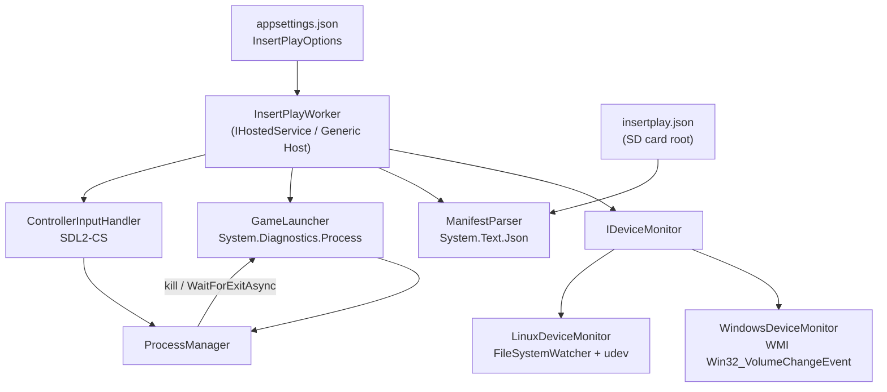
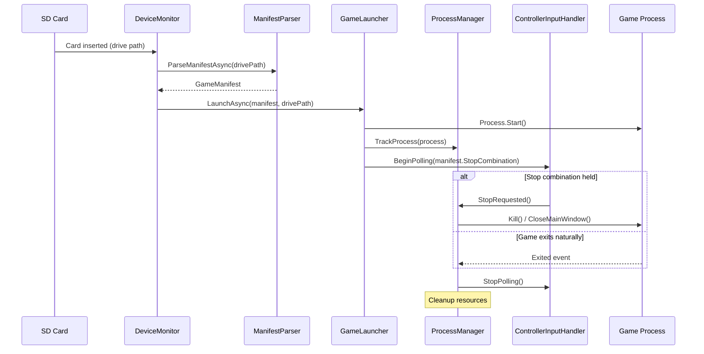
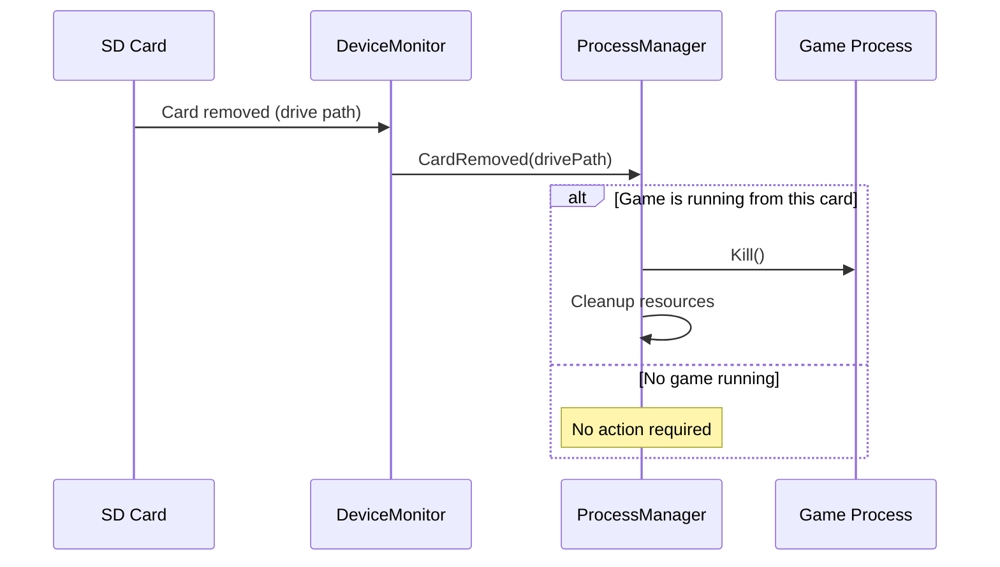

# Architecture

This document describes the internal architecture of `insert-play-service`, its components, data flows, and platform-specific design decisions.

---

## Overview

InsertPlay is a long-running background service built on the .NET 8 Generic Host (`IHostedService`). It listens for removable media events, parses game manifests from SD cards, and manages the full lifecycle of game processes.

The service is structured around a thin platform abstraction layer that isolates OS-specific code (device detection) from cross-platform business logic.

---

## Component Diagram



---

## Data Flow — Card Insertion



## Data Flow — Card Removal



---

## Components

### `InsertPlayWorker` (Entry Point)

The `IHostedService` implementation hosted by the .NET Generic Host. Owns the top-level lifecycle: starts the `IDeviceMonitor` and wires up event handlers for `CardInserted` and `CardRemoved`.

### `IDeviceMonitor`

Abstraction interface for OS-specific removable media detection.

```csharp
public interface IDeviceMonitor
{
    event EventHandler<CardEventArgs> CardInserted;
    event EventHandler<CardEventArgs> CardRemoved;
    Task StartAsync(CancellationToken cancellationToken);
    Task StopAsync(CancellationToken cancellationToken);
}
```

#### `WindowsDeviceMonitor`

- Uses WMI `ManagementEventWatcher` with a `Win32_VolumeChangeEvent` WQL query (`EventType` 2 = insert, 3 = remove) to detect removable drive changes.
- Identifies a valid game card by the presence of `insertplay.json` at the drive root.

#### `LinuxDeviceMonitor`

- Watches `/media` and `/run/media/$USER` using `FileSystemWatcher` for directory creation/deletion events. udev mounts removable drives there by default on SteamOS, Arch Linux, and Ubuntu.
- Falls back to polling `DriveInfo.GetDrives()` filtered by `DriveType.Removable` on distributions where the mount path differs.
- Same card identification strategy: checks for `insertplay.json` at the mounted path.

### `ManifestParser`

Reads and deserializes `insertplay.json` from the SD card root using `System.Text.Json` with source generation for AOT-safe, allocation-efficient parsing. Validates required fields and logs warnings for unknown fields.

### `GameLauncher`

Starts the game process using `System.Diagnostics.Process` with `ProcessStartInfo` built from the manifest fields. Key behaviors:

- Sets `WorkingDirectory` from the manifest or defaults to the executable's parent directory.
- Does not redirect stdio by default (the game owns its own terminal or window).
- On Windows, supports optional elevation via `Verb = "runas"` when configured.
- Returns the started `Process` object to `ProcessManager`.

### `ProcessManager`

Tracks the active `Process` and handles termination:

- Subscribes to `process.Exited` (`EnableRaisingEvents = true`) for natural exit detection.
- Exposes `StopAsync()` for forced termination triggered by `ControllerInputHandler` or a `CardRemoved` event.
- Uses `WaitForExitAsync(CancellationToken)` (.NET 5+) as the primary async wait mechanism.
- Logs exit code and total session duration after each game session.
- Always `Dispose()`s the `Process` handle after exit to prevent handle leaks.

### `ControllerInputHandler`

Polls SDL2 (via SDL2-CS) on a dedicated background thread at a configurable interval (default: 50 ms). Detects when **all** buttons in `StopCombination` are simultaneously held. Fires a `StopRequested` event consumed by `ProcessManager`.

Button names in `stopCombination` are mapped to `SDL_GameControllerButton` enum values, with a fallback to raw joystick button indices for non-standard devices. See [manifest-spec.md — Stop Combination Button Names](manifest-spec.md#stop-combination-button-names) for the full list.

### Configuration (`InsertPlayOptions`)

Strongly-typed options class bound from `appsettings.json` via `IOptions<InsertPlayOptions>`. See [configuration.md](configuration.md) for all options.

---

## Platform Abstraction Design

```
src/
├── InsertPlay.Core/                 # Platform-agnostic business logic
│   ├── IDeviceMonitor.cs
│   ├── ManifestParser.cs
│   ├── GameLauncher.cs
│   ├── ProcessManager.cs
│   ├── ControllerInputHandler.cs
│   └── Models/
│       ├── GameManifest.cs
│       └── InsertPlayOptions.cs
├── InsertPlay.Windows/              # Windows-specific implementations
│   └── WindowsDeviceMonitor.cs
├── InsertPlay.Linux/                # Linux-specific implementations
│   └── LinuxDeviceMonitor.cs
└── InsertPlay.Service/              # Service host entry point
    └── Program.cs                   ← DI wiring: registers the correct
                                       IDeviceMonitor per OS at startup
```

The correct `IDeviceMonitor` implementation is registered at startup based on `RuntimeInformation.IsOSPlatform(OSPlatform.Windows)`. All other components in `InsertPlay.Core` are OS-agnostic and never reference platform-specific types.

---

## Technology Decisions

| Concern | Choice | Rationale |
|---|---|---|
| Runtime | .NET 8 | LTS, cross-platform, Native AOT support |
| Service host | Generic Host (`IHostedService`) | Standard .NET service model; maps cleanly to both Windows Service and systemd |
| SD detection — Windows | `RegisterDeviceNotification` + WMI fallback | Lowest latency (~100 ms); WMI fallback covers service contexts without a message pump |
| SD detection — Linux | `FileSystemWatcher` on `/media` paths | No native dependencies; covers SteamOS and most Linux distros without udev rules |
| Controller input | SDL2-CS | Only actively maintained cross-platform gamepad library for .NET; handles XInput, DirectInput, HID, and evdev transparently |
| JSON parsing | `System.Text.Json` + source generation | No external dependencies; AOT-compatible; built-in schema-like validation via required properties |
| Process management | `System.Diagnostics.Process` | Built-in; `WaitForExitAsync` available since .NET 5; no extra dependencies |
